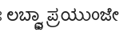

## Reasons for non-distribution
### Devangari
- Adishila - No clear license.
- Lohit
  - Suboptimal rendering  - ಲಬ್ಧ್ವಾ
    
- Gargi - Unicode deviations - chandra vowel sign

### Kannada
- Kedage, Malige - untested

### Telugu
- Pothana2000, Vemana - restricted license, non-ascii name

### Misc untested
- Malayalam 
  - Meera
  - Rachana
- Oriya 
  - Utkal
- Bengali 
  - Mukti
- Gujarati
  - rekhA